# Spring-Boot and JKube plug-in on Minikube
### JKube - Build and Deploy java applications on Kubernetes
 

**Pre-requisites**

- Java 8 and above
- K3s or Minikube or any Cloud Kubernetes Cluster - Configured in your local
- Maven - Configured

1. Create Spring Boot Application using Spring Initializr

https://start.spring.io/

**Project**: Maven  
**Language**: Java  
**Spring Boot**: 2.7.14

**Project Metadata**
Group: com.example  
Artifact: jkube-demo  
Name: jkube-demo  
Description: Demo project for Spring Boot  
Package name: com.example

Packaging: Jar  
Java: 17

**Dependencies**  
Spring Web  
Spring Boot Dev Tools  
Spring Boot Actuator

Click on GENERATE to create Spring Boot Application as shown in the below image:

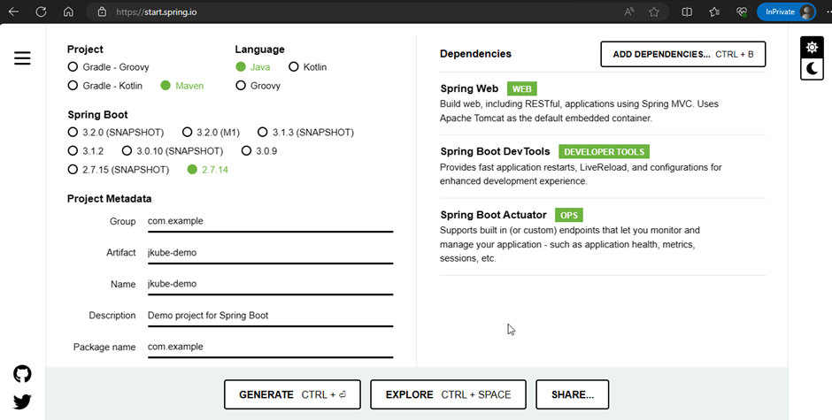

2. Download and open in your favourite Java IDE  
  
3. Open pom.xml file and add few thing in it.

Add the image parameter and kubernetes service parameter to access pod 
```
   <properties>
   	<java.version>11</java.version>
   	<jkube.generator.name>docker.io/<<your docker id goes here>>/hello-jkube:${project.version}</jkube.generator.name>
   	<jkube.enricher.jkube-service.type>NodePort</jkube.enricher.jkube-service.type>
   </properties>
```

Add the eclipse JKube plug-in in the build section  

```
	<build>
		<plugins>
			<plugin>
				<groupId>org.springframework.boot</groupId>
				<artifactId>spring-boot-maven-plugin</artifactId>
			</plugin>

			<plugin>
				<groupId>org.eclipse.jkube</groupId>
				<artifactId>kubernetes-maven-plugin</artifactId>
				<version>1.13.1</version>
			</plugin>
		</plugins>
	</build>
```
4. Create Controller

```
package com.example.controller;

import org.springframework.web.bind.annotation.GetMapping;
import org.springframework.web.bind.annotation.RequestParam;
import org.springframework.web.bind.annotation.RestController;

@RestController
public class HelloJKube {

    @GetMapping("/hello")
    public String sayHello() {
        return "Hello JKube";
    }
}
```
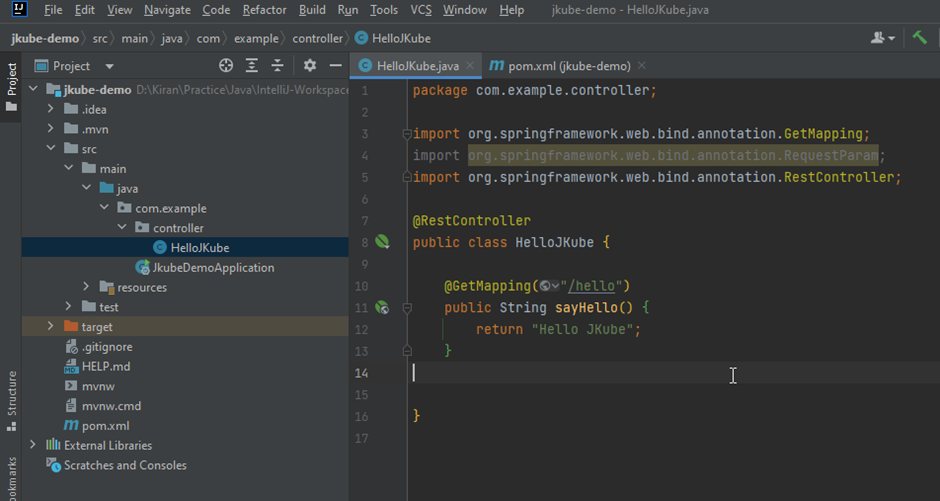

5. Compile and package/bundle your Spring boot project

```
mvn clean compile
mvn clean package
```

6. Start the Minikube Cluster

```
minikube start
```

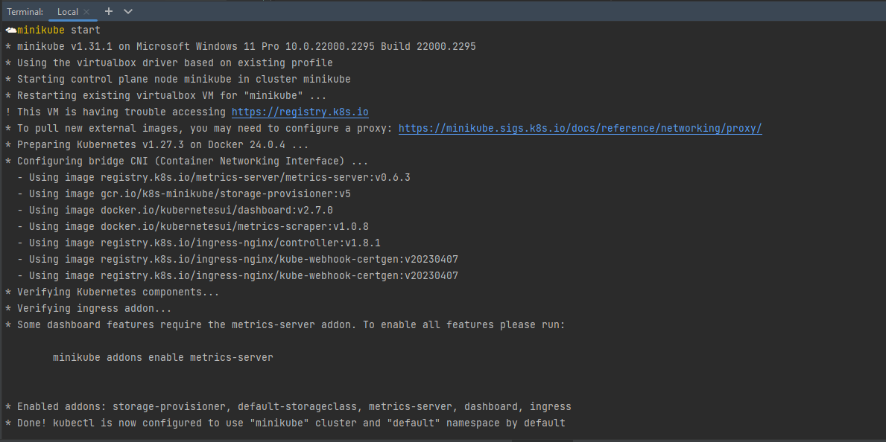

7. Open Git Bash (If you are in Windows) Or Terminal

Execute the below command to provides instructions to point your terminal’s docker-cli to the Docker Engine inside minikube. (Useful for building docker images directly inside minikube)

```
eval $(minikube -p minikube docker-env --shell=bash)

or

eval $(SHELL=/bin/bash minikube -p minikube docker-env)
```
8. Run the following command to build docker image inside the minikube docker environment for the spring boot application

```
mvn k8s:build
```
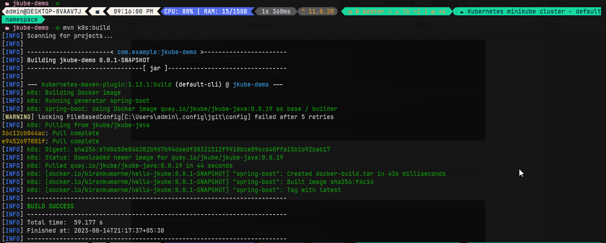

9. Run the following command to generate kubernetes resource files for the spring boot application

This will generate the kubernetes resource files in the below location:  
jkube-demo\target\classes\META-INF\jkube\kubernetes\

- jkube-demo-deployment.yml
- jkube-demo-service.yml

```
mvn k8s:resource
```

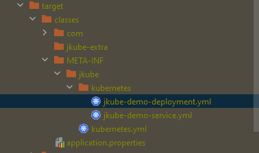

10. Run the following command to deploy on the kuberenetes cluster

```
mvn k8s:apply
```

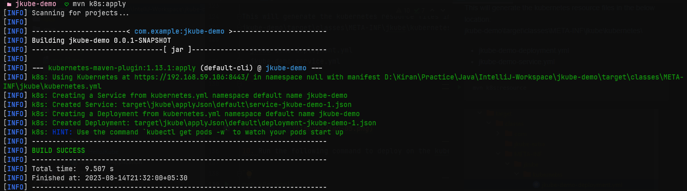

11. Check the pod is running 
```
kubectl get po 
```
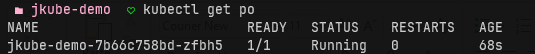

```
kubectl get svc 
```

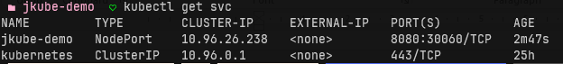

Notice that the service in NodePort., that means we can access our application using minikube IP and the port
```
minikube ip
```
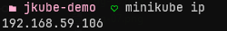

http://192.168.59.106:30060/hello

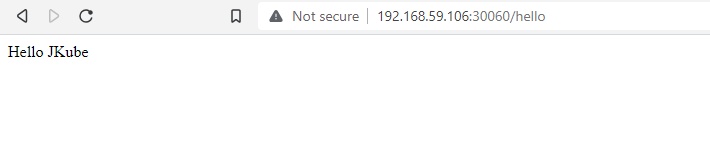

You can also see the logs by executing the below command
```
mvn k8s:log
```
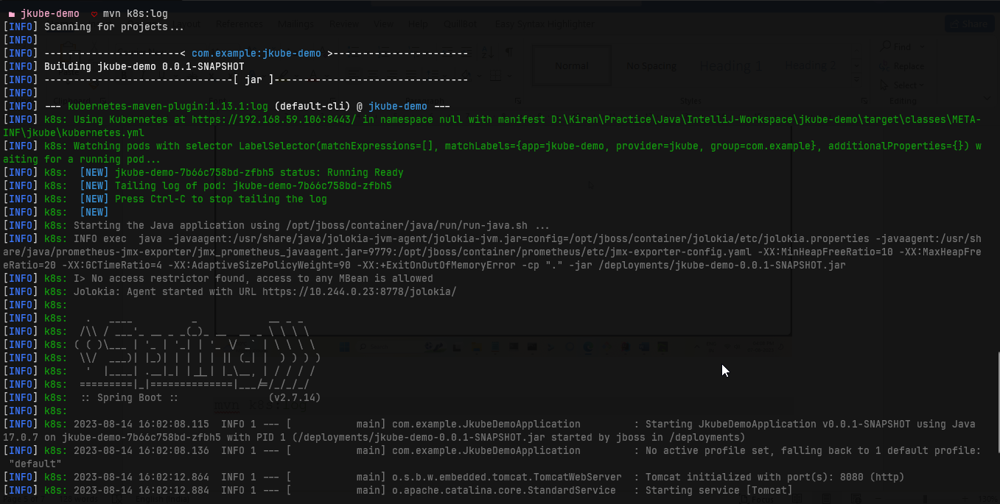

**Troubleshoot**

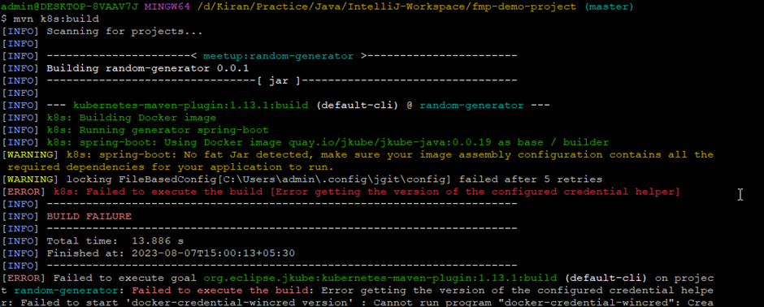

- Download the static binary archive. Go to https://download.docker.com/win/static/stable/x86_64 and select the latest version from the list.

- Run the following PowerShell commands to install and extract the archive to your program files:

```
Expand-Archive /path/to/<FILE>.zip -DestinationPath $Env:ProgramFiles
```

- Add the path to the Docker CLI binary (C:\Program Files\Docker) to the PATH environment variable, guide to setting environment variables in Windows.

- Restart Windows for the PATH change to take effect.

- Open the file and modify as shown below C:\Users\<your login folder>\.docker\config.json

```
{
    "auths": {
    },
    "HttpHeaders": {
        "User-Agent": "Docker-Client/18.09.1 (windows)"
    }
}
```

